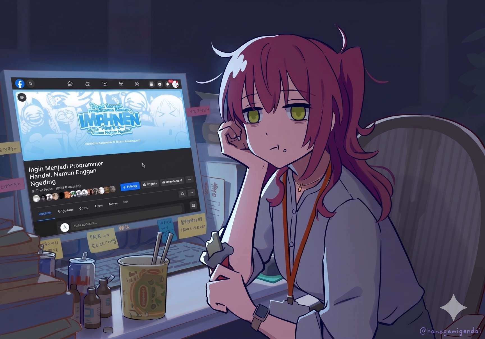

  

# ME RN :

  

  
  
  

# Anyway, Welcome To My GitHub Account

  

Hi, I'm **Oktora Rizka**. I have been passionate about IT since vocational high school (SMK), where I started learning to build games, applications, and websites. Currently, I am a student at **Mataram University** majoring in **Informatics Engineering**.

I am dedicated to becoming a **Game Developer**, focusing on **Godot Engine** and various other development projects. I'm glad you're here to visit my GitHub profile!

## 🛠 Tech Stack

    
  
  
  
  
  

  
  

  
  
  
   

## 📊 GitHub Stats:

   

## 🏆 GitHub Trophies

  

  

  

